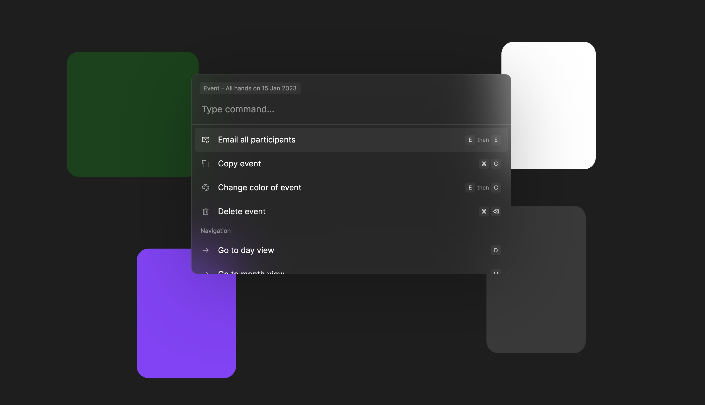

### Command Menu UI

To run this locally:

- Clone the repo
- `npm install && npm run dev`

For a live preview, visit [rise-command-menu.vercel.app](https://rise-command-menu.vercel.app/)

#### Useful info

Keyboard shortcuts with single keystrokes and sequential keystrokes (e.g "`d`" or "`e` then `e`") are available only when the input is unfocused, while combinations like `⌘⌫` or `⌘C` are available also when the input is focused as they do not overlap with the typing.

#### Stack used foir this project

- [Next.js](https://nextjs.org/docs/getting-started)
- [TailwindCSS](https://tailwindcss.com/docs/installation)
- [cmdk](https://cmdk.paco.me/)
- [@radix-ui/react-toast](https://www.radix-ui.com/docs/primitives/components/toast)
- [react-hotkeys-hook](https://react-hotkeys-hook.vercel.app/docs)
- [clsx](https://www.npmjs.com/package/clsx)
- [tailwind-merge](https://www.npmjs.com/package/tailwind-merge) - Thanks [Dany](https://github.com/dcastil) :)